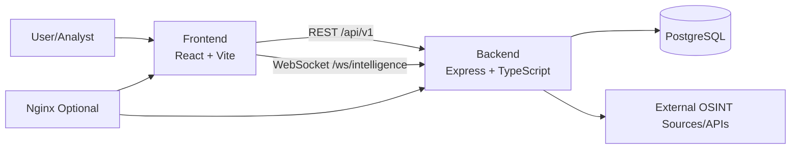
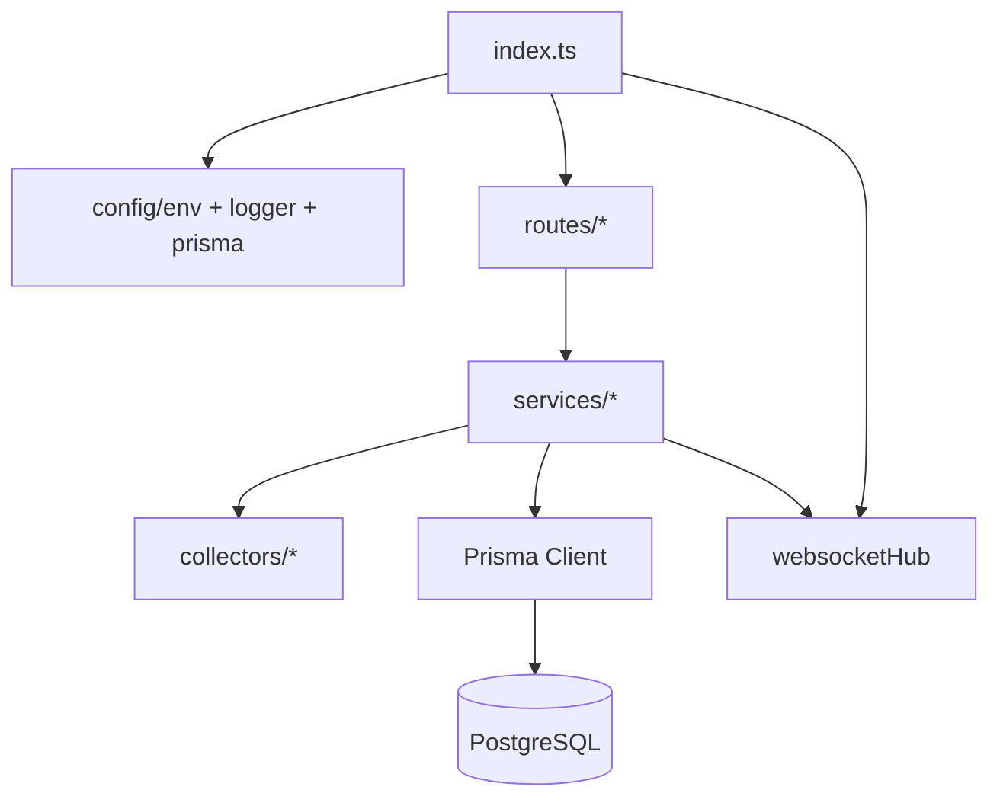
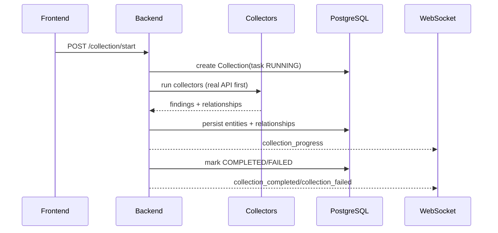
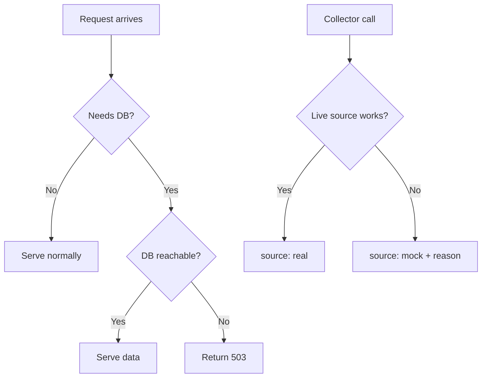

# Blueprint

## System Architecture

```mermaid
flowchart LR
    U[User/Analyst] --> FE[Frontend<br/>React + Vite]
    FE -->|REST /api/v1| BE[Backend<br/>Express + TypeScript]
    FE -->|WebSocket /ws/intelligence| BE
    BE --> DB[(PostgreSQL)]
    BE --> EXT[External OSINT Sources/APIs]
    NGINX[Nginx Optional] --> FE
    NGINX --> BE
```

## Backend Internal Modules

```mermaid
flowchart TB
    IDX[index.ts]
    RT[routes/*]
    SV[services/*]
    COL[collectors/*]
    CFG[config/env + logger + prisma]
    PR[Prisma Client]
    DB[(PostgreSQL)]
    WS[websocketHub]

    IDX --> CFG
    IDX --> RT
    IDX --> WS
    RT --> SV
    SV --> COL
    SV --> PR
    PR --> DB
    SV --> WS
```

## Collection Pipeline

```mermaid
sequenceDiagram
    participant F as Frontend
    participant B as Backend
    participant C as Collectors
    participant P as PostgreSQL
    participant W as WebSocket

    F->>B: POST /collection/start
    B->>P: create Collection(task RUNNING)
    B->>C: run collectors (real API first)
    C-->>B: findings + relationships
    B->>P: persist entities + relationships
    B-->>W: collection_progress
    B->>P: mark COMPLETED/FAILED
    B-->>W: collection_completed/collection_failed
```

## Resilience Rules

```mermaid
flowchart TD
    A[Request arrives] --> B{Needs DB?}
    B -- No --> C[Serve normally]
    B -- Yes --> D{DB reachable?}
    D -- Yes --> E[Serve data]
    D -- No --> F[Return 503]
    G[Collector call] --> H{Live source works?}
    H -- Yes --> I[source: real]
    H -- No --> J[source: mock + reason]
```
