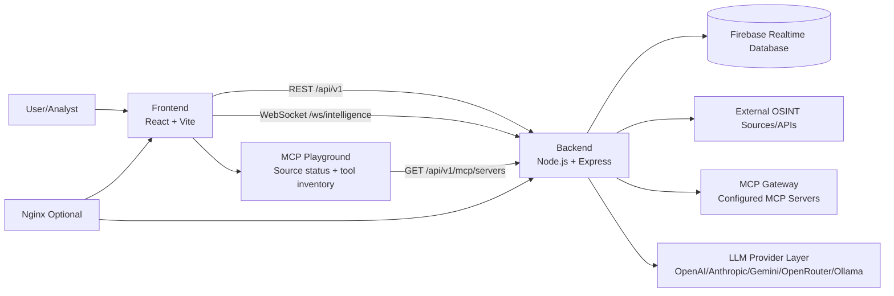
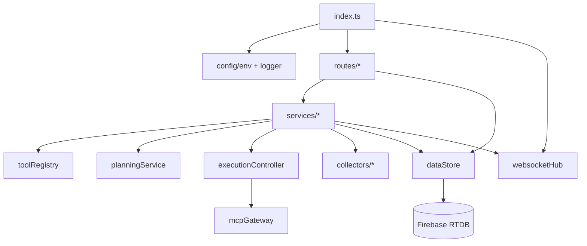
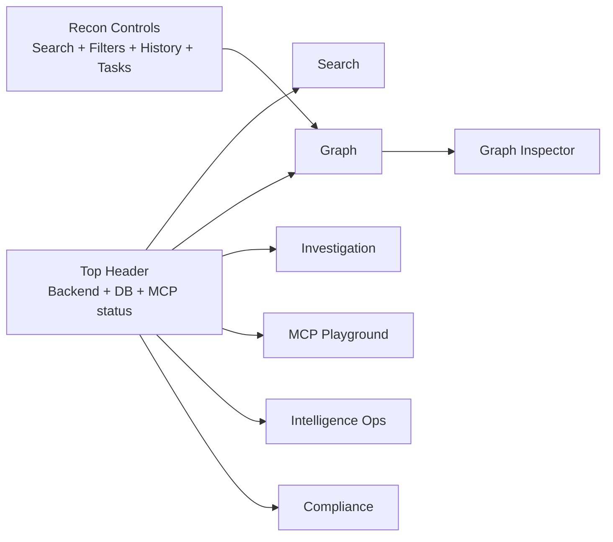
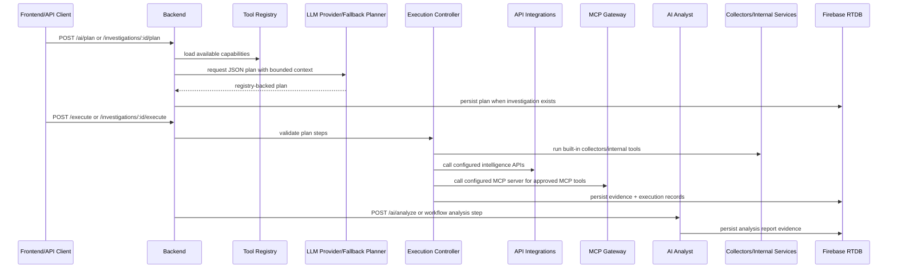
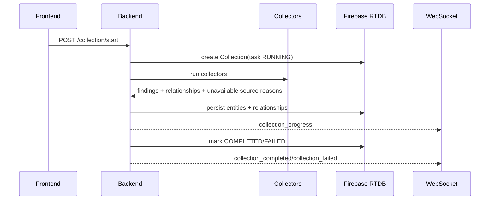
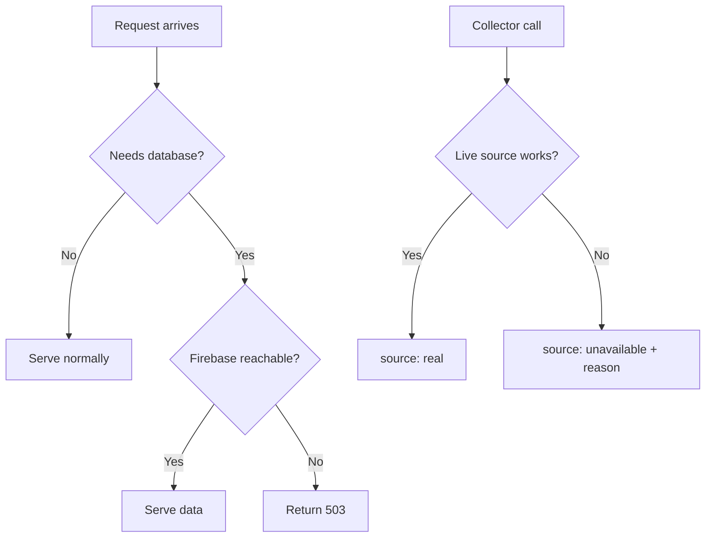

# Blueprint

## System Architecture

## Backend Internal Modules

## Frontend Workspace Layout

## v2 AI-Orchestrated Investigation Pipeline

The planner never executes commands. It returns tool names and structured inputs only. The execution controller rejects unknown tools and raw command fields.

## Collection Pipeline

## Resilience Rules

